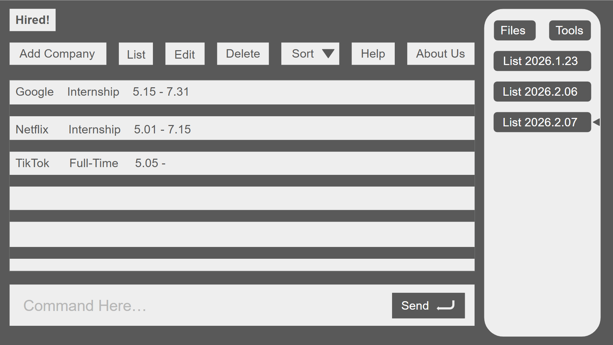

This project is based on the AddressBook-Level3 project created by the [SE-EDU initiative](https://se-education.org).

# Hired!
Hired! is a command-line internship application tracker designed for university students who want to efficiently manage internship applications, deadlines, and company contacts.

*Figure: Main interface of Hired!*

## Table of Contents

- [Background](#background)
- [Target User](#target-user)
- [Value Proposition](#value-proposition)
- [Features](#features)
- [Contributing](#contributing)

## Background
  University students often apply to multiple internships and struggle to track deadlines, contacts, and application progress using scattered tools such as notes or spreadsheets. This project provides a command-line internship application tracker that allows students to efficiently record application details, monitor deadlines, and track their internship search in an organized way.

## Target User
This application is designed for university students who:
- Apply to multiple internships simultaneously
- Prefer fast keyboard-based interaction
- Want a simple way to track companies, contacts, and application progress

## Value Proposition
Instead of managing internship applications through messy notes or spreadsheets, this application provides a structured command-line system that allows students to efficiently record internship details, monitor deadlines, and track application progress in one place.

## Features
### MVP
### Add Application Record (`add`)
Allows users to add a new internship application including company name, HR contact, internship role, and application deadline.

### Update Application Status (`status`)
Users can update the progress of an application with statuses such as **applied, interviewing, offered, rejected, or withdrawn**.

### View Application Summary (`list`)
Displays all internship applications in a structured list, allowing users to quickly see company, role, status, and deadline.

### Delete Application Record (`delete`)
Allows users to remove incorrect or outdated application records using a unique application ID.

### Future Enhancements
The following features may be added in future versions:

- Interview notes and question tracking
- Resume version tracking
- Application reminders for deadlines and follow-ups
- Filtering and categorization by industry
- Exporting internship records for analysis
- Visual summaries of application outcomes

## Contributing
This project was developed by cs students based on AddressBook Level 3 (AB3).
- [Brenda Tan Kai Xin](https://github.com/brenda77777)
- [Gao HuiYing](https://github.com/ghyyuan)
- [Guo Xingchen](https://github.com/Xingchen722)
- [Li Qiyu](http://github.com/leechy67)
- [Oh Jing Yang](http://github.com/Jiya-OH)
