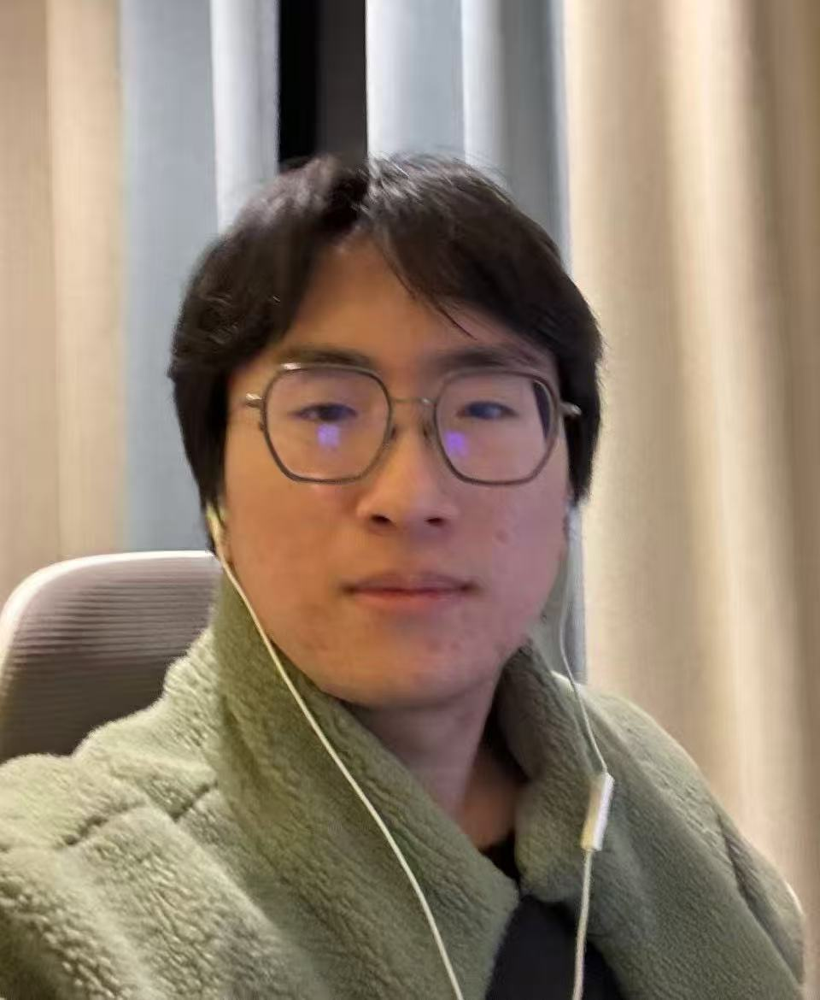

We are a team based in the [School of Computing, National University of Singapore](https://www.comp.nus.edu.sg).

You can reach us at the email `seer[at]comp.nus.edu.sg`

## Project team

### Jing Yang

[[github](http://github.com/Jiya-OH)]

* Role: Software Developer
* Responsibilities: Creating, designing, and programming,
* Running tests to identify bugs and troubleshooting issues to ensure software functionality.

### Gao Huiying

[[github](https://github.com/ghyyuan)]

* Role: Software Developer (Integration)
* Responsibilities: Lead the implementation of core features, ensuring system reliability through unit testing and documentation.
Manage the project repository and branching strategy to integrate individual modules into a cohesive, high-quality software release.

### Li Qiyu

[[github](http://github.com/leechy67)]

* Role: Team Leader
* Responsibilities: software development

### Guo Xingchen

[[github](https://github.com/Xingchen722)]

* Role: Tech Lead
* Responsibilities: software development

### Brenda Tan Kai Xin

[[github](https://github.com/brenda77777)]

* Role: Tech Lead 
* Responsibilities: Design and implement backend features. Review pull requests and maintain code quality.
Coordinate integration of team features.
